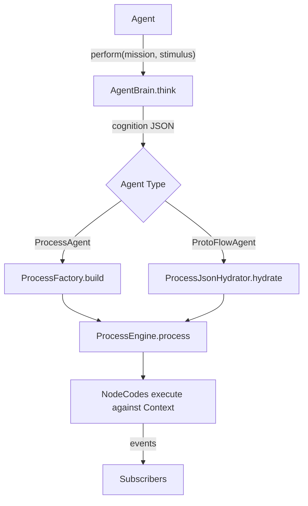

# Feral Agent Module — TypeScript Port Plan

> Port the `feral-agent` Symfony bundle's NodeCodes, CatalogNodes, event subscribers, Agent system, and supporting utilities to TypeScript, building on the existing Feral CCF core framework.

## System Overview

The `feral-agent` PHP module extends the **Feral CCF core** with AI-agent-specific capabilities:

- **10 NodeCodes** — reusable logic units for GenAI calls, data synthesis, file I/O, model hydration, etc.
- **~17 CatalogNodes** — pre-configured NodeCode instances (e.g. `open_ai_4o`, `perplexity_large`, `model_to_json`)
- **3 Event Subscribers** — Logger, CycleDetection, Profiler
- **Agent System** — `ProcessAgent` (selects from pre-built processes) and `ProtoFlowAgent` (builds processes on-the-fly) with a pluggable `AgentBrain`
- **RenderPrompt** — generates LLM-friendly descriptions of the catalog for ProtoFlowAgent
- **DataCollector/Trace** — process profiling infrastructure



---

## User Review Required

> [!IMPORTANT]
> **PHP-specific NodeCodes**: `WriteEntityNodeCode` (Doctrine ORM) and `WriteToRedisNodeCode` (phpredis) depend on PHP-specific infrastructure. The plan proposes TypeScript equivalents using generic interfaces — please confirm this approach or if these should be deferred.

> [!WARNING]
> **`ModelToOutputContext` and `HydrateModelWithResponse`** use PHP Reflection + `AiContext` attributes to inspect class properties at runtime. The TS port replaces this with a **schema registry** approach. Review this design decision in [Component 2](#2-genai-data-nodecodes).

---

## Proposed Changes

### 1. Core Data NodeCodes

Simple data-manipulation nodes that map cleanly to TypeScript.

#### [NEW] [merge-strings-node-code.ts](file:///src/node-code/data/merge-strings-node-code.ts)

- Port of `MergeStringsNodeCode` (key: `merge_strings`)
- Reads an array of context paths, concatenates their string values, writes to output path
- Config: `input_array_context_path` (string[]), `output_context_path` (string)

#### [NEW] [data-synthesis-prep-node-code.ts](file:///src/node-code/data/data-synthesis-prep-node-code.ts)

- Port of `DataSynthesisPreparationNodeCode` (key: `synthesis_prep`)
- Supports both simple string paths and `{header, data}` objects for structured synthesis
- Config: `input_array_context_path` (string[]), `output_context_path` (string[])

#### [NEW] [write-file-node-code.ts](file:///src/node-code/data/write-file-node-code.ts)

- Port of `WriteFile` (key: `write_file`)
- Uses Node.js `fs.writeFileSync` instead of PHP `file_put_contents`
- Config: `input_context_path` (string), `file_context_path` (string)

#### [NEW] [generate-html-node-code.ts](file:///src/node-code/data/generate-html-node-code.ts)

- Port of `GenerateHtmlFromMarkdown` (key: `convert_html`)
- Uses `marked` npm package (lightweight) instead of PHP CommonMark
- Config: `input_context_path`, `output_context_path` (default: `html_data`)

#### [NEW] [generate-pdf-node-code.ts](file:///src/node-code/data/generate-pdf-node-code.ts)

- Port of `GeneratePdfFromMarkdown` (key: `generate_pdf`)
- Uses `puppeteer` or `pdf-lib` — proposes a pluggable `PdfGenerator` interface for flexibility
- Config: `input_context_path`, `output_context_path` (default: `pdf_data`)

---

### 2. GenAI Data NodeCodes

Nodes that interact with LLM APIs and process AI responses.

#### [NEW] [openai-node-code.ts](file:///src/node-code/genai/openai-node-code.ts)

- Port of `OpenAiNodeCode` (key: `open_ai`)
- Uses the `openai` npm SDK instead of PHP's OpenAI client
- Interleaves system/user/assistant messages identically to PHP version
- Reads bearer token from `process.env[bearerTokenVariable]`
- Config: `base_path`, `bearer_token_variable`, `model`, `max_tokens` (default: 6500), `output_context_path`, `system_context_path`, `user_context_path`, `assistant_context_path`
- **6 CatalogNodes** auto-registered: `open_ai_4o`, `open_ai_4o_mini`, `open_ai_4_turbo`, `perplexity_small`, `perplexity_large`, `perplexity_huge`

#### [NEW] [model-to-output-node-code.ts](file:///src/node-code/genai/model-to-output-node-code.ts)

- Port of `ModelToOutputContext` (key: `model_to_output`)
- **PHP uses `ReflectionClass` + `AiContext` attributes** — TypeScript replaces this with a **schema registry**: a `Map<string, ModelSchema>` where `ModelSchema` describes properties, types, descriptions, intents, and examples
- Generates prompt text describing each property for the LLM
- Config: `model_context_path`, `output_context_path` (default: `prompt_output`), `preamble_context_path`
- **2 CatalogNodes**: `model_to_output`, `model_to_json`

#### [NEW] [hydrate-model-node-code.ts](file:///src/node-code/genai/hydrate-model-node-code.ts)

- Port of `HydrateModelWithResponse` (key: `hydrate_model`)
- Extracts JSON from ` ```json ... ``` ` blocks, strips comments, hydrates an object via the schema registry
- Config: `model_context_path`, `output_context_path` (default: `prompt_output`), `input_context_path`
- **1 CatalogNode**: `hydrate_model`

#### [NEW] [model-schema.ts](file:///src/node-code/genai/model-schema.ts)

- New TypeScript-native replacement for `AiContext` PHP attributes + `ReflectionClass`
- Defines `ModelSchema` interface and a `ModelSchemaRegistry` class

```typescript
export interface ModelPropertySchema {
  name: string;
  type: 'string' | 'number' | 'boolean' | 'string[]' | 'number[]' | 'object';
  description?: string;
  intent?: string;
  examples?: string[];
}

export interface ModelSchema {
  className: string;
  properties: ModelPropertySchema[];
  factory: (data: Record<string, unknown>) => unknown;
}

export class ModelSchemaRegistry {
  private schemas = new Map<string, ModelSchema>();
  register(schema: ModelSchema): void { ... }
  get(className: string): ModelSchema { ... }
}
```

---

### 3. Infrastructure NodeCodes

Nodes with external infrastructure dependencies — ported with pluggable interfaces.

#### [NEW] [write-entity-node-code.ts](file:///src/node-code/data/write-entity-node-code.ts)

- Port of `WriteEntityNodeCode` (key: `write_entity`)
- Replaces Doctrine `EntityManagerInterface` with a generic `EntityPersister` interface
- Config: `entity_context_path`

```typescript
export interface EntityPersister {
  persist(entity: unknown): Promise<void>;
}
```

#### [NEW] [write-to-redis-node-code.ts](file:///src/node-code/data/write-to-redis-node-code.ts)

- Port of `WriteToRedisNodeCode` (key: `write_redis`)
- Replaces PHP `Redis` extension with a generic `KeyValueStore` interface
- Config: `value_context_path`, `redis_key`, `ttl` (optional)

```typescript
export interface KeyValueStore {
  set(key: string, value: string, ttlSeconds?: number): Promise<void>;
}
```

---

### 4. Event Subscribers

Port the 3 Symfony event subscribers to the TypeScript `EventDispatcher`.

#### [NEW] [logger-subscriber.ts](file:///src/events/subscribers/logger-subscriber.ts)

- Enhanced version of the existing skeleton in the core plan
- Maps result severity (error/warning/debug) just like the PHP version
- Subscribes to all 6 event types

#### [NEW] [cycle-detection-subscriber.ts](file:///src/events/subscribers/cycle-detection-subscriber.ts)

- Enhanced version: supports context-driven `maximum_visits` override (reads from `context.getInt('maximum_visits')`)
- Resets counts on `process.start`, checks on `process.node.before`

#### [NEW] [profiler-subscriber.ts](file:///src/events/subscribers/profiler-subscriber.ts)

- Port of `ProfilerProcessSubscriber`
- Wraps a `ProcessTraceCollector` interface to record timing and execution data
- Development-only subscriber (consumer decides when to wire it)

---

### 5. Process Trace / DataCollector

#### [NEW] [process-trace.ts](file:///src/trace/process-trace.ts)

- Port of `ProcessTrace`, `ProcessRunTrace`, `ProcessTraceBuilder`, `ProcessTraceCollector` interfaces
- TypeScript data types for trace records: start/end timestamps, node key, result, context snapshot

#### [NEW] [process-trace-collector.ts](file:///src/trace/process-trace-collector.ts)

- Port of `ProcessTraceCollectorInterface` + `ProcessTraceCollector`
- In-memory collector that the profiler subscriber writes to

---

### 6. Agent System

#### [NEW] [agent-brain.ts](file:///src/agent/agent-brain.ts)

- Port of `AgentBrainInterface` — simple `think(prompt: string): Promise<AgentThought>` interface
- `AgentThought` is `{ content: string }` (or error)

#### [NEW] [chatgpt-brain.ts](file:///src/agent/chatgpt-brain.ts)

- Port of `ChatGPTBrain`
- Uses the `openai` npm SDK (same dependency as `OpenAiNodeCode`)
- Constructor takes `apiUrl`, `model`, `apiKey`

#### [NEW] [agent.ts](file:///src/agent/agent.ts)

- Port of `AgentInterface` + `AgentResult` enum
- `AgentResult` = `SUCCESS | FAILURE | INSUFFICIENT_PROCESSING_FAILURE`

#### [NEW] [process-agent.ts](file:///src/agent/process-agent.ts)

- Port of `ProcessAgent`
- Given a mission + stimulus, asks the brain to select a process and initial context, then runs it
- Includes timing/logging via `console.time` or an injected logger

#### [NEW] [protoflow-agent.ts](file:///src/agent/protoflow-agent.ts)

- Port of `ProtoFlowAgent`
- Instead of selecting a process, asks the brain to **build** a complete process JSON
- Hydrates + validates + executes the LLM-generated process

---

### 7. Render Prompt

#### [NEW] [render-prompt.ts](file:///src/agent/render-prompt.ts)

- Port of `RenderPrompt`
- Iterates over the `Catalog` and `NodeCodeFactory` to generate a human/LLM-readable description
- Explains the process JSON schema, node configuration requirements, and available catalog nodes
- Used by `ProtoFlowAgent` to give the LLM instructions on how to build a process

---

### 8. Bootstrap / Container Wiring

In PHP, `FeralAgentBundle` + `CollectTaggedServicesPass` use Symfony DI to:
1. Auto-tag all `NodeCodeInterface` implementations as `feral.nodecode`
2. Auto-tag all `CatalogNodeInterface` implementations as `feral.catalog_node`
3. Collect tagged services into `NodeCodeSource` / `CatalogSource` wrappers
4. Inject those sources into `NodeCodeFactory`, `Catalog`, `ProcessFactory`, and `ProcessValidator`
5. Optionally load processes from a `configuration_directory`

The bundle config supports `included_sources` (e.g. `tagged_nodecode_source`, `tagged_catalog_source`, `tagged_process_source`) to control which auto-registration is active.

#### [NEW] [bootstrap.ts](file:///src/bootstrap.ts)

- Replaces the Symfony DI container + compiler pass with a **builder pattern**
- Wires all agent NodeCodes, CatalogNodes, subscribers, and optionally an Agent

```typescript
export class FeralAgentBootstrap {
  private nodeCodeSources: NodeCodeSource[] = [];
  private catalogSources: CatalogSource[] = [];
  private processSources: ProcessSource[] = [];
  private subscribers: ((d: EventDispatcher) => void)[] = [];

  /** Register the built-in agent NodeCodes and CatalogNodes */
  withAgentDefaults(): this { ... }

  /** Add a directory of process JSON files */
  withProcessDirectory(dir: string): this { ... }

  /** Add custom NodeCodeSource / CatalogSource */
  addNodeCodeSource(source: NodeCodeSource): this { ... }
  addCatalogSource(source: CatalogSource): this { ... }

  /** Build the fully wired Runner */
  build(): { runner: Runner; catalog: Catalog; engine: ProcessEngine } { ... }

  /** Build a ProcessAgent with an AgentBrain */
  buildAgent(brain: AgentBrain): ProcessAgent { ... }
}
```

---

### 9. CatalogNode Registration

All CatalogNodes declared via PHP `#[CatalogNodeDecorator]` attributes become entries in a `CatalogSource`. Each NodeCode file exports a companion `getCatalogNodes()` function.

#### [NEW] [agent-catalog-source.ts](file:///src/catalog/agent-catalog-source.ts)

- Implements `CatalogSource` for all agent-module CatalogNodes
- Registers all ~17 catalog nodes:

| Key | NodeCode Key | Group | Configuration |
|---|---|---|---|
| `open_ai_4o` | `open_ai` | GenAI | base_path, model=gpt-4o, bearer=OPENAPI_KEY |
| `open_ai_4o_mini` | `open_ai` | GenAI | model=gpt-4o-mini |
| `open_ai_4_turbo` | `open_ai` | GenAI | model=gpt-4o-mini |
| `perplexity_small` | `open_ai` | GenAI | api.perplexity.ai, llama-3.1-sonar-large |
| `perplexity_large` | `open_ai` | GenAI | api.perplexity.ai, llama-3.1-sonar-large |
| `perplexity_huge` | `open_ai` | GenAI | api.perplexity.ai, llama-3.1-sonar-huge |
| `hydrate_model` | `hydrate_model` | Data | — |
| `model_to_output` | `model_to_output` | Data | — |
| `model_to_json` | `model_to_output` | Data | preamble preset |
| `merge_strings` | `merge_strings` | Data | — |
| `synthesis_prep` | `synthesis_prep` | GenAI | — |
| `write_file` | `write_file` | Data | — |
| `convert_html` | `convert_html` | Data | — |
| `generate_pdf` | `generate_pdf` | Data | — |
| `write_entity` | `write_entity` | Data | — |
| `write_redis` | `write_redis` | Data | — |

---

### 10. NodeCode Registration

#### [NEW] [agent-node-code-source.ts](file:///src/node-code/agent-node-code-source.ts)

- Implements `NodeCodeSource` for all 10 agent NodeCodes
- Factory that instantiates each NodeCode with appropriate dependencies

---

### 11. Directory Structure

```
feral-agent-ts/   (or new directory within existing project)
├── src/
│   ├── node-code/
│   │   ├── agent-node-code-source.ts
│   │   ├── data/
│   │   │   ├── merge-strings-node-code.ts
│   │   │   ├── data-synthesis-prep-node-code.ts
│   │   │   ├── write-file-node-code.ts
│   │   │   ├── generate-html-node-code.ts
│   │   │   ├── generate-pdf-node-code.ts
│   │   │   ├── write-entity-node-code.ts
│   │   │   └── write-to-redis-node-code.ts
│   │   └── genai/
│   │       ├── openai-node-code.ts
│   │       ├── model-to-output-node-code.ts
│   │       ├── hydrate-model-node-code.ts
│   │       └── model-schema.ts
│   ├── catalog/
│   │   └── agent-catalog-source.ts
│   ├── bootstrap.ts
│   ├── events/
│   │   └── subscribers/
│   │       ├── logger-subscriber.ts        (enhanced)
│   │       ├── cycle-detection-subscriber.ts (enhanced)
│   │       └── profiler-subscriber.ts
│   ├── trace/
│   │   ├── process-trace.ts
│   │   └── process-trace-collector.ts
│   ├── agent/
│   │   ├── agent.ts                        (interface + enum)
│   │   ├── agent-brain.ts                  (interface)
│   │   ├── chatgpt-brain.ts
│   │   ├── process-agent.ts
│   │   ├── protoflow-agent.ts
│   │   └── render-prompt.ts
│   └── index.ts                            (re-exports)
```

---

### 12. PHP → TypeScript Translation Notes (Agent-specific)

| PHP Concept | TypeScript Equivalent |
|---|---|
| `#[CatalogNodeDecorator(...)]` | `createCatalogNode({...})` entries in `AgentCatalogSource` |
| `#[StringConfigurationDescription]` | `static configDescriptions: ConfigurationDescription[]` |
| Doctrine `EntityManagerInterface` | `EntityPersister` interface |
| Redis `\Redis` extension | `KeyValueStore` interface |
| `ReflectionClass` + `AiContext` attr | `ModelSchemaRegistry` |
| `$_ENV[...]` | `process.env[...]` |
| `FeralAgentBundle` + compiler pass | `FeralAgentBootstrap` builder class |
| Symfony DI tagged services | Explicit `NodeCodeSource[]` / `CatalogSource[]` arrays |
| `configuration_directory` config | `withProcessDirectory(dir)` builder method |
| Symfony `HttpClient` / `Psr18Client` | `openai` npm SDK |
| `Stopwatch` | `performance.now()` or `console.time()` |
| `CommonMarkConverter` | `marked` npm package |
| `Mpdf` | `PdfGenerator` interface (pluggable) |

---

### 13. Implementation Order

1. **Model Schema** — `model-schema.ts` (no dependencies)
2. **Data NodeCodes** — merge-strings, data-synthesis-prep, write-file (pure context manipulation)
3. **GenAI NodeCodes** — openai, model-to-output, hydrate-model
4. **Infrastructure NodeCodes** — write-entity, write-to-redis, generate-html, generate-pdf
5. **Event Subscribers** — enhanced logger, cycle-detection, profiler
6. **Process Trace** — trace types + collector
7. **Agent System** — brain interface, chatgpt-brain, agent interface, process-agent, protoflow-agent
8. **Render Prompt** — catalog renderer
9. **Registration** — agent-catalog-source, agent-node-code-source
10. **Bootstrap** — `FeralAgentBootstrap` builder
11. **Index** — public API exports

---

### 14. Dependencies

**Required npm packages** (added to `package.json`):
- `openai` — OpenAI SDK for `OpenAiNodeCode` and `ChatGPTBrain`
- `marked` — Markdown-to-HTML conversion

**Optional/pluggable** (consumer provides):
- PDF generation library (e.g. `puppeteer`, `pdf-lib`)
- Redis client (e.g. `ioredis`)
- Database ORM (e.g. `prisma`, `drizzle`, `typeorm`)

---

## Verification Plan

### Manual Verification

Since this is a plan document (like the original `FeralCCI-TypeScript-Plan.md`), verification is primarily:

1. **Review the plan** for completeness against the PHP source — all 10 NodeCodes, all CatalogNode decorators, all 3 subscribers, both Agents, and supporting classes are accounted for
2. **Confirm the design decisions** around `ModelSchemaRegistry` vs PHP Reflection, `EntityPersister` vs Doctrine, and `KeyValueStore` vs Redis
3. **When implemented**, run `tsc --noEmit` to verify type-safety and `vitest run` for unit tests
