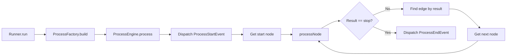

# Feral CCF — TypeScript Port Plan

> A complete guide to porting the Feral Code Composition Framework from PHP/Symfony to TypeScript as an embeddable library.

## 1. System Overview

Feral CCF is a **Flow-Based Programming (FBP)** engine. A **Process** is a directed graph where:
- **Nodes** execute code against a shared **Context** (data bag)
- **Edges** route execution between nodes based on string **Result** statuses (e.g. `"ok"`, `"true"`, `"false"`, `"stop"`)
- **Configuration** is layered: NodeCode defaults → CatalogNode config → ProcessNode config

### Node Hierarchy

```
NodeCode (reusable logic)
  └─▶ CatalogNode (NodeCode + partial config, lives in a Catalog)
        └─▶ ProcessNode (CatalogNode + process-specific config, lives in a Process)
```

### Execution Flow



---

## 2. Core Interfaces & Classes

### 2.1 Result

The return value from every NodeCode execution. Used for flow control (edge routing) and logging.

**PHP Source:** `src/Process/Result/ResultInterface.php`, `Result.php`

```typescript
// src/result/result.ts

/** Well-known result status constants used as edge selectors */
export const ResultStatus = {
  OK: 'ok',
  SKIP: 'skip',
  STOP: 'stop',
  WARNING: 'warning',
  ERROR: 'error',
  TRUE: 'true',
  FALSE: 'false',
  PRIMARY: 'primary',
  SECONDARY: 'secondary',
  TERTIARY: 'tertiary',
  LOW: 'low',
  MEDIUM: 'medium',
  HIGH: 'high',
  GREATER_THAN: 'gt',
  GREATER_THAN_EQUAL: 'gte',
  LESS_THAN: 'lt',
  LESS_THAN_EQUAL: 'lte',
} as const;

export type ResultStatusValue = (typeof ResultStatus)[keyof typeof ResultStatus] | string;

export interface Result {
  /** The status string used for edge routing */
  readonly status: ResultStatusValue;
  /** Human-readable message for logging */
  readonly message: string;
}

/** Factory helper */
export function createResult(status: ResultStatusValue, message = ''): Result {
  return { status, message };
}
```

**Key decisions:**
- Use a plain object (interface) instead of a class — immutable, serializable
- `ResultStatus` is a const object so custom string statuses are still allowed
- Provide a `createResult` factory for convenience

---

### 2.2 Context

A key-value data bag passed through every node. Nodes read and mutate it.

**PHP Source:** `src/Process/Context/ContextInterface.php`, `Context.php`

```typescript
// src/context/context.ts

export interface Context {
  set(key: string, value: unknown): void;
  get(key: string): unknown;
  has(key: string): boolean;
  remove(key: string): void;
  clear(key: string): boolean;
  getAll(): Record<string, unknown>;

  // Typed accessors
  getInt(key: string): number;
  getFloat(key: string): number;
  getString(key: string): string;
  getArray(key: string): unknown[];
  getObject<T = Record<string, unknown>>(key: string): T;
}

export class DefaultContext implements Context {
  private data: Record<string, unknown> = {};

  set(key: string, value: unknown): void { this.data[key] = value; }
  get(key: string): unknown { return this.data[key] ?? null; }
  has(key: string): boolean { return key in this.data && this.data[key] != null; }
  remove(key: string): void { this.data[key] = null; }
  clear(key: string): boolean {
    if (this.has(key)) { this.data[key] = null; return true; }
    return false;
  }
  getAll(): Record<string, unknown> { return { ...this.data }; }

  getInt(key: string): number { return Number(this.data[key]) | 0; }
  getFloat(key: string): number { return Number(this.data[key]); }
  getString(key: string): string { return String(this.data[key] ?? ''); }
  getArray(key: string): unknown[] { return Array.isArray(this.data[key]) ? this.data[key] as unknown[] : []; }
  getObject<T = Record<string, unknown>>(key: string): T { return this.data[key] as T; }
}
```

---

### 2.3 Configuration System

Three-tier configuration with secret masking and optional/required semantics.

**PHP Source:** `src/Process/Configuration/ConfigurationValue.php`, `ConfigurationValueType.php`, `ConfigurationManager.php`

```typescript
// src/configuration/configuration-value.ts

export enum ConfigurationValueType {
  STANDARD = 'STANDARD',
  SECRET = 'SECRET',
  OPTIONAL = 'OPTIONAL',
  OPTIONAL_SECRET = 'OPTIONAL_SECRET',
}

export interface ConfigurationValue {
  key: string;
  type: ConfigurationValueType;
  value?: unknown;
  default?: unknown;
}

export function isSecret(cv: ConfigurationValue): boolean {
  return cv.type === ConfigurationValueType.SECRET || cv.type === ConfigurationValueType.OPTIONAL_SECRET;
}

export function resolveValue(cv: ConfigurationValue): unknown {
  if (cv.value != null) return isSecret(cv) ? '*********' : cv.value;
  return cv.default ?? null;
}

export function resolveUnmaskedValue(cv: ConfigurationValue): unknown {
  return cv.value ?? cv.default ?? null;
}
```

```typescript
// src/configuration/configuration-manager.ts

export class ConfigurationManager {
  static readonly DELETE = '_DELETE_';
  private config: Map<string, ConfigurationValue> = new Map();

  merge(overrides: ConfigurationValue[]): void {
    for (const cv of overrides) {
      if (this.config.has(cv.key) && cv.value === ConfigurationManager.DELETE) {
        this.config.delete(cv.key);
      } else {
        this.config.set(cv.key, cv);
      }
    }
  }

  hasValue(key: string): boolean {
    const cv = this.config.get(key);
    return cv != null && cv.value != null;
  }

  hasDefault(key: string): boolean {
    const cv = this.config.get(key);
    return cv != null && cv.default != null;
  }

  getValue(key: string): unknown {
    const cv = this.config.get(key);
    if (!cv) return null;
    if (cv.value != null) return cv.value;
    return cv.default ?? null;
  }

  getUnmaskedValue(key: string): unknown {
    const cv = this.config.get(key);
    return cv?.value ?? cv?.default ?? null;
  }

  getAll(): Map<string, ConfigurationValue> {
    return new Map(this.config);
  }
}
```

#### Configuration Description (replaces PHP Attributes)

PHP uses `#[Attribute]` decorators on NodeCode classes to declare what configuration keys they accept. In TypeScript, use a **static method or property** pattern instead:

```typescript
// src/configuration/configuration-description.ts

export interface ConfigurationDescription {
  key: string;
  name: string;
  description: string;
  type: 'string' | 'int' | 'float' | 'boolean' | 'string_array' | 'int_array' | 'float_array';
  default?: unknown;
  isSecret?: boolean;
  isOptional?: boolean;
  options?: string[];         // enumerated valid values
}

export interface ResultDescription {
  status: string;
  description: string;
}
```

NodeCode classes declare their config descriptors via a static property:

```typescript
export class SetContextValueNodeCode implements NodeCode {
  static readonly configDescriptions: ConfigurationDescription[] = [
    { key: 'value', name: 'Value', description: 'The value to set', type: 'string' },
    { key: 'context_path', name: 'Context Path', description: 'Target key', type: 'string' },
    { key: 'value_type', name: 'Value Type', description: 'Type cast', type: 'string',
      options: ['string', 'int', 'float'] },
  ];
  static readonly resultDescriptions: ResultDescription[] = [
    { status: 'ok', description: 'Value was set successfully.' },
  ];
  // ...
}
```

---

### 2.4 NodeCode

The executable unit of logic. Every NodeCode:
1. Has metadata (key, name, description, category)
2. Accepts configuration via `addConfiguration()`
3. Processes a Context and returns a Result

**PHP Source:** `src/Process/NodeCode/NodeCodeInterface.php`, traits in `Traits/`

```typescript
// src/node-code/node-code.ts

export interface NodeCode {
  readonly key: string;
  readonly name: string;
  readonly description: string;
  readonly categoryKey: string;

  /** Merge configuration values into this node code */
  addConfiguration(values: ConfigurationValue[]): void;

  /** Execute the node logic against the context */
  process(context: Context): Result;
}
```

#### Base class (replaces PHP traits)

PHP uses `NodeCodeMetaTrait`, `ResultsTrait`, `ConfigurationTrait`, `ConfigurationValueTrait` etc. In TypeScript, use an **abstract base class**:

```typescript
// src/node-code/abstract-node-code.ts

export abstract class AbstractNodeCode implements NodeCode {
  readonly key: string;
  readonly name: string;
  readonly description: string;
  readonly categoryKey: string;
  protected configManager: ConfigurationManager;

  constructor(key: string, name: string, description: string, categoryKey: string) {
    this.key = key;
    this.name = name;
    this.description = description;
    this.categoryKey = categoryKey;
    this.configManager = new ConfigurationManager();
  }

  addConfiguration(values: ConfigurationValue[]): void {
    this.configManager.merge(values);
  }

  /** Helper: create a Result */
  protected result(status: ResultStatusValue, message = ''): Result {
    return createResult(status, message);
  }

  /** Helper: get a required config value, throw if missing */
  protected getRequiredConfigValue(key: string, fallback?: unknown): unknown {
    const val = this.configManager.getValue(key);
    if (val != null) return val;
    if (fallback !== undefined) return fallback;
    throw new MissingConfigurationValueError(key);
  }

  /** Helper: get an optional config value */
  protected getOptionalConfigValue(key: string, fallback?: unknown): unknown {
    return this.configManager.getValue(key) ?? fallback ?? null;
  }

  abstract process(context: Context): Result;
}
```

#### NodeCode Categories

```typescript
export const NodeCodeCategory = {
  FLOW: 'flow',
  DATA: 'data',
  WORK: 'work',
} as const;
```

#### Example: StartProcessingNode

```typescript
export class StartNodeCode extends AbstractNodeCode {
  static readonly configDescriptions: ConfigurationDescription[] = [];
  static readonly resultDescriptions: ResultDescription[] = [
    { status: ResultStatus.OK, description: 'The start node was successful.' },
  ];

  constructor() {
    super('start', 'Start Process', 'The node that starts a process.', NodeCodeCategory.FLOW);
  }

  process(_context: Context): Result {
    return this.result(ResultStatus.OK, 'Start processing.');
  }
}
```

#### Example: SetContextValueNodeCode

```typescript
export class SetContextValueNodeCode extends AbstractNodeCode {
  static readonly configDescriptions: ConfigurationDescription[] = [
    { key: 'value', name: 'Value', description: 'The value to set in the context.', type: 'string' },
    { key: 'context_path', name: 'Context Path', description: 'The key in the context.', type: 'string' },
    { key: 'value_type', name: 'Value Type', description: 'Type of variable.', type: 'string',
      options: ['string', 'int', 'float'] },
  ];

  constructor() {
    super('set_context_value', 'Set Data Value', 'Set value of a context key', NodeCodeCategory.DATA);
  }

  process(context: Context): Result {
    const valueType = this.getRequiredConfigValue('value_type', 'string') as string;
    const rawValue = this.getRequiredConfigValue('value') as string;
    const contextPath = this.getRequiredConfigValue('context_path') as string;

    let value: unknown;
    switch (valueType) {
      case 'string': value = String(rawValue); break;
      case 'int': value = parseInt(rawValue, 10); break;
      case 'float': value = parseFloat(rawValue); break;
      default: throw new Error(`Unknown type "${valueType}".`);
    }

    context.set(contextPath, value);
    return this.result(ResultStatus.OK, `Set value in context path "${contextPath}".`);
  }
}
```

#### NodeCodeFactory

Registry of all available NodeCode instances, populated from `NodeCodeSource` providers.

```typescript
// src/node-code/node-code-factory.ts

export interface NodeCodeSource {
  getNodeCodes(): NodeCode[];
}

export class NodeCodeFactory {
  private registry: Map<string, NodeCode> = new Map();

  constructor(sources: NodeCodeSource[] = []) {
    for (const source of sources) {
      for (const nc of source.getNodeCodes()) {
        if (nc.key) this.registry.set(nc.key, nc);
      }
    }
  }

  getNodeCode(key: string): NodeCode {
    const nc = this.registry.get(key);
    if (!nc) throw new InvalidNodeCodeKeyError(key);
    return nc;
  }

  getAllNodeCodes(): NodeCode[] {
    return Array.from(this.registry.values());
  }
}
```

---

### 2.5 CatalogNode

A NodeCode bound with partial configuration. Lives in a `Catalog`.

**PHP Source:** `src/Process/Catalog/CatalogNode/CatalogNodeInterface.php`, `CatalogNode.php`

```typescript
// src/catalog/catalog-node.ts

export interface CatalogNode {
  readonly key: string;
  readonly nodeCodeKey: string;
  readonly name: string;
  readonly group: string;
  readonly description: string;
  readonly configuration: Record<string, unknown>;
}

export function createCatalogNode(props: {
  key: string;
  nodeCodeKey: string;
  name?: string;
  group?: string;
  description?: string;
  configuration?: Record<string, unknown>;
}): CatalogNode {
  return {
    key: props.key,
    nodeCodeKey: props.nodeCodeKey,
    name: props.name ?? '',
    group: props.group ?? 'Ungrouped',
    description: props.description ?? '',
    configuration: props.configuration ?? {},
  };
}
```

#### Catalog

```typescript
// src/catalog/catalog.ts

export interface CatalogSource {
  getCatalogNodes(): CatalogNode[];
}

export class Catalog {
  private nodes: Map<string, CatalogNode> = new Map();

  constructor(sources: CatalogSource[] = []) {
    for (const source of sources) {
      for (const node of source.getCatalogNodes()) {
        if (node.key) this.nodes.set(node.key, node);
      }
    }
  }

  getCatalogNode(key: string): CatalogNode {
    const node = this.nodes.get(key);
    if (!node) throw new Error(`Catalog node "${key}" not found.`);
    return node;
  }

  getAllCatalogNodes(): CatalogNode[] {
    return Array.from(this.nodes.values());
  }
}
```

---

### 2.6 ProcessNode (Node)

A CatalogNode placed in a specific process, with optional additional configuration overrides.

**PHP Source:** `src/Process/Node/NodeInterface.php`, `Node.php`

```typescript
// src/process/node.ts

export interface ProcessNode {
  /** Unique key within the process */
  readonly key: string;
  readonly description: string;
  /** References a CatalogNode by key */
  readonly catalogNodeKey: string;
  /** Process-level configuration overrides */
  readonly configuration: Record<string, unknown>;
}
```

---

### 2.7 Edge

A connection between two ProcessNodes, selected by a result status string.

**PHP Source:** `src/Process/Edge/EdgeInterface.php`, `Edge.php`, `EdgeCollection.php`

```typescript
// src/process/edge.ts

export interface Edge {
  readonly fromKey: string;
  readonly toKey: string;
  readonly result: string;  // the result status that selects this edge
}

export class EdgeCollection {
  // Indexed: [fromKey][result] => Edge[]
  private collection: Map<string, Map<string, Edge[]>> = new Map();

  addEdge(edge: Edge): void {
    if (!this.collection.has(edge.fromKey)) this.collection.set(edge.fromKey, new Map());
    const resultMap = this.collection.get(edge.fromKey)!;
    if (!resultMap.has(edge.result)) resultMap.set(edge.result, []);
    resultMap.get(edge.result)!.push(edge);
  }

  getEdgesByNodeAndResult(fromKey: string, result: string): Edge[] {
    return this.collection.get(fromKey)?.get(result) ?? [];
  }

  getAllEdges(): Edge[] {
    const all: Edge[] = [];
    for (const resultMap of this.collection.values()) {
      for (const edges of resultMap.values()) {
        all.push(...edges);
      }
    }
    return all;
  }
}
```

---

### 2.8 Process

The complete process definition: key, description, nodes, edges, and initial context data.

**PHP Source:** `src/Process/ProcessInterface.php`, `Process.php`

```typescript
// src/process/process.ts

export interface Process {
  readonly key: string;
  readonly description: string;
  readonly context: Context;
  readonly nodes: ProcessNode[];
  readonly edges: Edge[];
}
```

---

### 2.9 ProcessConfiguration (JSON Hydration)

Loads a process from a JSON configuration file.

**PHP Source:** `src/Process/ProcessJsonHydrator.php`

```typescript
// src/process/process-json-hydrator.ts

export interface ProcessConfigJson {
  schema_version: number;
  key: string;
  version?: number;
  description?: string;
  context: Record<string, unknown>;
  nodes: Array<{
    key: string;
    description?: string;
    catalog_node_key: string;
    configuration: Record<string, unknown>;
    edges: Record<string, string>;  // result → target node key
  }>;
}

export function hydrateProcess(json: ProcessConfigJson): Process {
  if (json.schema_version !== 1) throw new Error('Only schema version 1 is accepted');
  if (!json.key) throw new Error('A key is required for a process.');

  const context = new DefaultContext();
  for (const [k, v] of Object.entries(json.context)) {
    context.set(k, v);
  }

  const nodes: ProcessNode[] = [];
  const edges: Edge[] = [];

  for (const nodeDef of json.nodes) {
    nodes.push({
      key: nodeDef.key,
      description: nodeDef.description ?? '',
      catalogNodeKey: nodeDef.catalog_node_key,
      configuration: nodeDef.configuration ?? {},
    });

    for (const [result, toKey] of Object.entries(nodeDef.edges)) {
      edges.push({ fromKey: nodeDef.key, toKey, result });
    }
  }

  return { key: json.key, description: json.description ?? '', context, nodes, edges };
}

/** Convenience: parse raw JSON string */
export function hydrateProcessFromString(jsonString: string): Process {
  const parsed = JSON.parse(jsonString) as ProcessConfigJson;
  return hydrateProcess(parsed);
}
```

---

## 3. Events System

PHP uses Symfony's `EventDispatcherInterface`. In TypeScript, implement a simple typed emitter.

**PHP Source:** `src/Process/Event/Process*Event.php` (6 event classes)

```typescript
// src/events/events.ts

export interface ProcessStartEvent {
  type: 'process.start';
  process: Process;
  context: Context;
}

export interface ProcessEndEvent {
  type: 'process.end';
  process: Process;
  context: Context;
}

export interface ProcessNodeBeforeEvent {
  type: 'process.node.before';
  node: ProcessNode;
  context: Context;
}

export interface ProcessNodeAfterEvent {
  type: 'process.node.after';
  node: ProcessNode;
  context: Context;
  result: Result;
}

export interface ProcessExceptionEvent {
  type: 'process.exception';
  nodeCode: NodeCode;
  context: Context;
  error: Error;
}

export interface ProcessNodeNotifyEvent {
  type: 'process.node.notify';
  nodeCode: NodeCode;
  context: Context;
  notice: string;
}

export type ProcessEvent =
  | ProcessStartEvent | ProcessEndEvent
  | ProcessNodeBeforeEvent | ProcessNodeAfterEvent
  | ProcessExceptionEvent | ProcessNodeNotifyEvent;

export type EventType = ProcessEvent['type'];
```

```typescript
// src/events/event-dispatcher.ts

export type EventHandler<T extends ProcessEvent = ProcessEvent> = (event: T) => void;

export class EventDispatcher {
  private handlers: Map<string, EventHandler[]> = new Map();

  on<T extends ProcessEvent>(type: T['type'], handler: EventHandler<T>): void {
    if (!this.handlers.has(type)) this.handlers.set(type, []);
    this.handlers.get(type)!.push(handler as EventHandler);
  }

  off<T extends ProcessEvent>(type: T['type'], handler: EventHandler<T>): void {
    const list = this.handlers.get(type);
    if (list) {
      const idx = list.indexOf(handler as EventHandler);
      if (idx >= 0) list.splice(idx, 1);
    }
  }

  dispatch(event: ProcessEvent): void {
    const list = this.handlers.get(event.type);
    if (list) {
      for (const handler of list) handler(event);
    }
  }
}
```

### Event Subscribers (Examples)

```typescript
// src/events/subscribers/logger-subscriber.ts
export function createLoggerSubscriber(logger: (msg: string) => void): (dispatcher: EventDispatcher) => void {
  return (dispatcher) => {
    dispatcher.on('process.start', (e) => logger(`Process "${e.process.key}" started`));
    dispatcher.on('process.end', (e) => logger(`Process "${e.process.key}" ended`));
    dispatcher.on('process.node.after', (e) => logger(`Node "${e.node.key}" → ${e.result.status}: ${e.result.message}`));
    dispatcher.on('process.exception', (e) => logger(`Exception in node: ${e.error.message}`));
  };
}

// src/events/subscribers/cycle-detection-subscriber.ts
export function createCycleDetectionSubscriber(maxRuns: number): (dispatcher: EventDispatcher) => void {
  return (dispatcher) => {
    const counts = new Map<string, number>();
    dispatcher.on('process.node.before', (e) => {
      const count = (counts.get(e.node.key) ?? 0) + 1;
      counts.set(e.node.key, count);
      if (count > maxRuns) throw new MaximumNodeRunsError(e.node.key, maxRuns);
    });
  };
}
```

---

## 4. ProcessEngine

The core execution loop. Resolves NodeCode from CatalogNode references, layers configuration, and runs the node graph.

**PHP Source:** `src/Process/Engine/ProcessEngine.php`

```typescript
// src/engine/process-engine.ts

export class ProcessEngine {
  private cachedNodeCodes: Map<string, NodeCode> = new Map();

  constructor(
    private eventDispatcher: EventDispatcher,
    private catalog: Catalog,
    private nodeCodeFactory: NodeCodeFactory,
  ) {}

  process(process: Process, context: Context, startNodeKey = 'start'): void {
    const nodeMap = new Map(process.nodes.map(n => [n.key, n]));
    const edgeCollection = new EdgeCollection();
    for (const edge of process.edges) edgeCollection.addEdge(edge);

    // Merge process context into runtime context (process overrides runtime)
    for (const [k, v] of Object.entries(process.context.getAll())) {
      context.set(k, v);
    }

    this.eventDispatcher.dispatch({ type: 'process.start', process, context });

    let currentKey = startNodeKey;
    let node = nodeMap.get(currentKey);
    if (!node) throw new InvalidNodeKeyError(currentKey);
    let nodeCode = this.getConfiguredNodeCode(node);

    let result = this.processNode(node, nodeCode, context);

    while (result.status !== ResultStatus.STOP) {
      const edges = edgeCollection.getEdgesByNodeAndResult(currentKey, result.status);
      if (edges.length === 0) {
        throw new Error(`No edge found for node "${currentKey}" with result "${result.status}"`);
      }
      currentKey = edges[0].toKey;
      node = nodeMap.get(currentKey);
      if (!node) throw new InvalidNodeKeyError(currentKey);
      nodeCode = this.getConfiguredNodeCode(node);
      result = this.processNode(node, nodeCode, context);
    }

    this.eventDispatcher.dispatch({ type: 'process.end', process, context });
  }

  private getConfiguredNodeCode(node: ProcessNode): NodeCode {
    if (this.cachedNodeCodes.has(node.key)) return this.cachedNodeCodes.get(node.key)!;

    const catalogNode = this.catalog.getCatalogNode(node.catalogNodeKey);
    const nodeCode = this.nodeCodeFactory.getNodeCode(catalogNode.nodeCodeKey);

    // Get config descriptions from the NodeCode class
    const Ctor = nodeCode.constructor as any;
    const descriptions: ConfigurationDescription[] = Ctor.configDescriptions ?? [];

    // Build ConfigurationValue objects from descriptions
    const configValues: Map<string, ConfigurationValue> = new Map();
    const requiredKeys = new Set<string>();
    for (const desc of descriptions) {
      const type = desc.isSecret
        ? (desc.isOptional ? ConfigurationValueType.OPTIONAL_SECRET : ConfigurationValueType.SECRET)
        : (desc.isOptional ? ConfigurationValueType.OPTIONAL : ConfigurationValueType.STANDARD);
      const cv: ConfigurationValue = { key: desc.key, type, default: desc.default };
      configValues.set(desc.key, cv);
      if (!desc.isOptional && desc.default == null) requiredKeys.add(desc.key);
    }

    // Validate keys from catalog & process config
    const validKeys = new Set(configValues.keys());
    for (const k of Object.keys(catalogNode.configuration)) {
      if (!validKeys.has(k)) throw new Error(`Catalog config key "${k}" invalid for node "${catalogNode.key}". Valid: ${[...validKeys].join(', ')}`);
    }
    for (const k of Object.keys(node.configuration)) {
      if (!validKeys.has(k)) throw new Error(`Process config key "${k}" invalid for node "${node.key}". Valid: ${[...validKeys].join(', ')}`);
    }

    // Merge: catalog config, then process node config overrides
    const merged = { ...catalogNode.configuration, ...node.configuration };
    for (const [k, v] of Object.entries(merged)) {
      const cv = configValues.get(k)!;
      cv.value = v;
      requiredKeys.delete(k);
    }

    // Also remove required keys that have defaults
    for (const [k, cv] of configValues) {
      if (cv.default != null) requiredKeys.delete(k);
    }

    if (requiredKeys.size > 0) {
      throw new Error(`Missing required config: ${[...requiredKeys].join(', ')} for node "${node.key}"`);
    }

    nodeCode.addConfiguration(Array.from(configValues.values()));
    this.cachedNodeCodes.set(node.key, nodeCode);
    return nodeCode;
  }

  private processNode(node: ProcessNode, nodeCode: NodeCode, context: Context): Result {
    this.eventDispatcher.dispatch({ type: 'process.node.before', node, context });
    const result = nodeCode.process(context);
    this.eventDispatcher.dispatch({ type: 'process.node.after', node, context, result });
    return result;
  }
}
```

---

## 5. Runner

High-level API to run a process by key with initial context values.

**PHP Source:** `src/Process/Runner/Runner.php`

```typescript
// src/runner/runner.ts

export class Runner {
  constructor(
    private processFactory: ProcessFactory,
    private engine: ProcessEngine,
  ) {}

  run(processKey: string, contextValues: Record<string, unknown> = {}): Context {
    const context = new DefaultContext();
    for (const [k, v] of Object.entries(contextValues)) {
      context.set(k, v);
    }
    const process = this.processFactory.build(processKey);
    this.engine.process(process, context);
    return context;
  }
}
```

---

## 6. ProcessFactory

Aggregates process sources and builds processes by key with caching.

**PHP Source:** `src/Process/ProcessFactory.php`

```typescript
// src/process/process-factory.ts

export interface ProcessSource {
  getProcesses(): Process[];
}

export class ProcessFactory {
  private cache: Map<string, Process> = new Map();

  constructor(private sources: ProcessSource[] = []) {}

  build(key: string): Process {
    if (this.cache.has(key)) return this.cache.get(key)!;
    for (const source of this.sources) {
      for (const process of source.getProcesses()) {
        if (process.key === key) {
          this.cache.set(key, process);
          return process;
        }
      }
    }
    throw new Error(`Cannot find process with key "${key}"`);
  }

  getAllProcesses(): Process[] {
    return this.sources.flatMap(s => s.getProcesses());
  }
}
```

---

## 7. Errors / Exceptions

**PHP Source:** `src/Process/Exception/*.php`

```typescript
// src/errors.ts

export class FeralError extends Error { constructor(message: string) { super(message); this.name = 'FeralError'; } }
export class InvalidConfigurationError extends FeralError {}
export class InvalidNodeCodeKeyError extends FeralError {
  constructor(key: string) { super(`Invalid NodeCode key: "${key}"`); }
}
export class InvalidNodeKeyError extends FeralError {
  constructor(key: string) { super(`Invalid node key: "${key}"`); }
}
export class MaximumNodeRunsError extends FeralError {
  constructor(key: string, max: number) { super(`Node "${key}" exceeded maximum runs (${max})`); }
}
export class MissingConfigurationValueError extends FeralError {
  constructor(key: string) { super(`Missing required configuration value: "${key}"`); }
}
export class ProcessError extends FeralError {}
```

---

## 8. Built-in NodeCode to Port

These are the NodeCode implementations in the PHP codebase grouped by category:

### Flow Nodes
| PHP Class | Key | Purpose |
|---|---|---|
| `StartProcessingNode` | `start` | Returns OK to begin the process |
| `StopProcessingNode` | `stop` | Returns STOP to halt the process |
| `NoopNodeCode` | `noop` | Does nothing, returns OK |
| `ContextValueComparatorNodeCode` | `context_value_comparator` | Compares two context values, returns true/false/gt/lt etc. |
| `ContextValueResult` | `context_value_result` | Returns a result based on a context value |
| `ThrowExceptionNodeCode` | `throw_exception` | Throws an exception (for testing) |

### Data Nodes
| PHP Class | Key | Purpose |
|---|---|---|
| `SetContextValueNodeCode` | `set_context_value` | Sets a typed value in the context |
| `SetContextTableNodeCode` | `set_context_table` | Sets multiple context values |
| `CalculationNodeCode` | `calculation` | Math operations on context values |
| `CounterNodeCode` | `counter` | Increment/decrement a context value |
| `HttpDataNodeCode` | `http` | Makes HTTP requests, stores response in context |
| `JsonDecodeNodeCode` | `json_decode` | Decodes JSON string from context |
| `JsonEncodeNodeCode` | `json_encode` | Encodes context value to JSON string |
| `LogNodeCode` | `log` | Logs a message with template interpolation |
| `RandomValueNodeCode` | `random_value` | Generates random values |
| `ReadFileNodeCode` | `read_file` | Reads a file into context |

---

## 9. Directory Structure

```
feral-core-ts/
├── src/
│   ├── index.ts                        # Public API exports
│   ├── errors.ts                       # All custom error classes
│   ├── result/
│   │   └── result.ts                   # Result interface, ResultStatus constants
│   ├── context/
│   │   └── context.ts                  # Context interface + DefaultContext
│   ├── configuration/
│   │   ├── configuration-value.ts      # ConfigurationValue, ConfigurationValueType
│   │   ├── configuration-manager.ts    # ConfigurationManager
│   │   └── configuration-description.ts # ConfigurationDescription, ResultDescription
│   ├── node-code/
│   │   ├── node-code.ts                # NodeCode interface
│   │   ├── abstract-node-code.ts       # AbstractNodeCode base class
│   │   ├── node-code-factory.ts        # NodeCodeFactory + NodeCodeSource
│   │   ├── flow/                       # Flow NodeCode implementations
│   │   │   ├── start-node-code.ts
│   │   │   ├── stop-node-code.ts
│   │   │   ├── noop-node-code.ts
│   │   │   └── comparator-node-code.ts
│   │   └── data/                       # Data NodeCode implementations
│   │       ├── set-context-value-node-code.ts
│   │       ├── calculation-node-code.ts
│   │       ├── log-node-code.ts
│   │       └── ...
│   ├── catalog/
│   │   ├── catalog-node.ts             # CatalogNode interface + factory
│   │   └── catalog.ts                  # Catalog class + CatalogSource
│   ├── process/
│   │   ├── node.ts                     # ProcessNode interface
│   │   ├── edge.ts                     # Edge interface + EdgeCollection
│   │   ├── process.ts                  # Process interface
│   │   ├── process-factory.ts          # ProcessFactory + ProcessSource
│   │   └── process-json-hydrator.ts    # JSON → Process hydration
│   ├── engine/
│   │   └── process-engine.ts           # ProcessEngine
│   ├── runner/
│   │   └── runner.ts                   # Runner (high-level API)
│   └── events/
│       ├── events.ts                   # Event type definitions
│       ├── event-dispatcher.ts         # EventDispatcher
│       └── subscribers/               # Built-in subscribers
│           ├── logger-subscriber.ts
│           └── cycle-detection-subscriber.ts
├── tests/
│   ├── context/
│   ├── engine/
│   ├── node-code/
│   └── process/
├── package.json
├── tsconfig.json
└── README.md
```

---

## 10. PHP → TypeScript Translation Guide

| PHP Concept | TypeScript Equivalent |
|---|---|
| `interface` | `interface` |
| `class` | `class` |
| `trait` | Abstract base class or mixins |
| PHP `#[Attribute]` | Static class properties (`configDescriptions`, `resultDescriptions`) |
| `enum` (PHP 8.1) | `enum` or const object with `as const` |
| `mixed` | `unknown` |
| `array` (associative) | `Record<string, unknown>` or `Map<string, T>` |
| `array` (indexed) | `T[]` |
| Fluent setters (`return $this`) | Constructor params or factory functions (prefer immutability) |
| Symfony `EventDispatcherInterface` | Custom `EventDispatcher` class |
| Symfony DI `iterable` tagged services | Constructor injection of arrays |
| `Psr\EventDispatcher\StoppableEventInterface` | Optional `stopped` flag on events |
| `ReflectionClass` / attributes | Static properties on NodeCode classes |
| `static` return type | `this` return type |

---

## 11. Implementation Order

Build bottom-up so each layer can be tested independently:

1. **Errors** — `errors.ts`
2. **Result** — `result.ts`
3. **Context** — `context.ts` (+ tests)
4. **Configuration** — `configuration-value.ts`, `configuration-manager.ts`, `configuration-description.ts` (+ tests)
5. **NodeCode** — `node-code.ts`, `abstract-node-code.ts` (+ tests)
6. **Built-in NodeCode** — Start, Stop, Noop, SetContextValue, etc. (+ tests)
7. **CatalogNode + Catalog** — `catalog-node.ts`, `catalog.ts` (+ tests)
8. **Edge + EdgeCollection** — `edge.ts` (+ tests)
9. **ProcessNode + Process** — `node.ts`, `process.ts`
10. **ProcessJsonHydrator** — `process-json-hydrator.ts` (+ tests with sample JSON)
11. **Events** — `events.ts`, `event-dispatcher.ts`, subscribers (+ tests)
12. **ProcessEngine** — `process-engine.ts` (+ integration tests)
13. **ProcessFactory** — `process-factory.ts`
14. **Runner** — `runner.ts` (+ end-to-end tests with sample JSON process)
15. **Package & Export** — `index.ts`, `package.json`, `tsconfig.json`

---

## 12. Package Configuration

```jsonc
// package.json
{
  "name": "@feral/core",
  "version": "1.0.0",
  "type": "module",
  "main": "dist/index.js",
  "types": "dist/index.d.ts",
  "exports": {
    ".": { "import": "./dist/index.js", "types": "./dist/index.d.ts" }
  },
  "scripts": {
    "build": "tsc",
    "test": "vitest run",
    "test:watch": "vitest"
  },
  "devDependencies": {
    "typescript": "^5.x",
    "vitest": "^2.x"
  }
}
```

```jsonc
// tsconfig.json
{
  "compilerOptions": {
    "target": "ES2022",
    "module": "ESNext",
    "moduleResolution": "bundler",
    "declaration": true,
    "outDir": "dist",
    "rootDir": "src",
    "strict": true,
    "esModuleInterop": true,
    "skipLibCheck": true
  },
  "include": ["src"]
}
```

**Zero runtime dependencies** — the library should be self-contained for easy embedding.
