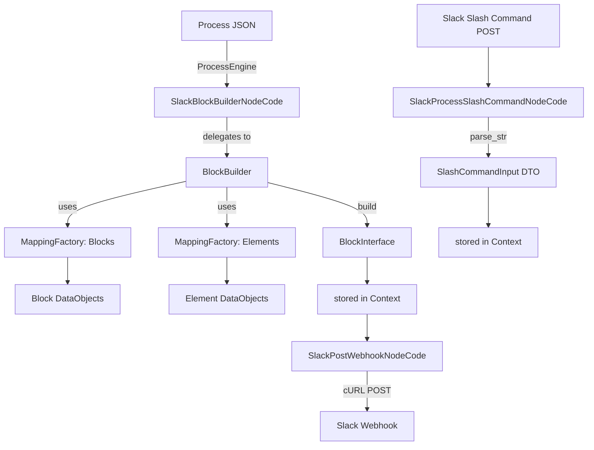
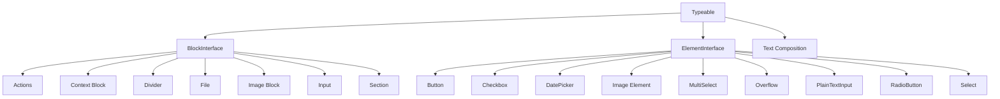
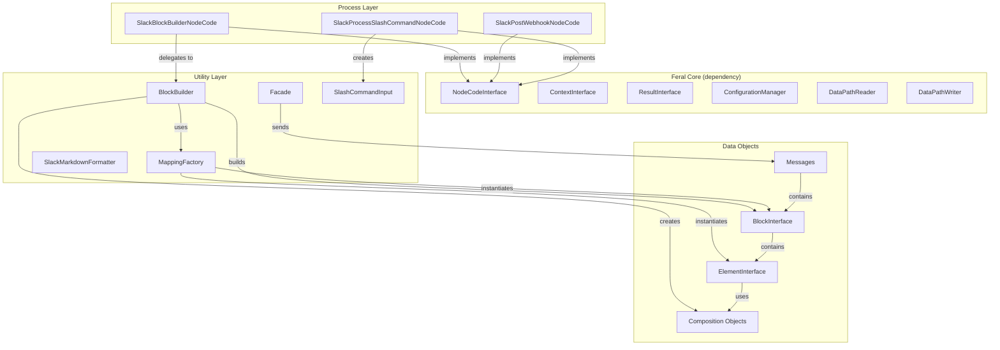

# Feral Slack — Symfony Library Build Plan

> A comprehensive guide to the `feral/slack` Symfony library: its architecture, every component, and how they integrate with the Feral CCF core framework.

## 1. System Overview

The `feral/slack` package extends **Feral CCF** with Slack-specific capabilities:

- **3 NodeCodes** — reusable logic units for building Slack Block Kit messages, posting to webhooks, and parsing slash commands
- **8 CatalogNodes** — pre-configured instances of `SlackBlockBuilderNodeCode` for each builder function (init, add-button, add-text, add-checkbox, add-image, add-datepicker, add-text-input, build)
- **Slack Block Kit SDK** — a complete object model for Slack's [Block Kit](https://api.slack.com/block-kit) including Blocks, Elements, Composition Objects, and Surfaces
- **BlockBuilder** — a fluent builder that composes Block Kit data objects with surface/block validation
- **Facade** — high-level API for sending messages to Slack webhooks
- **SlashCommandInput** — strongly-typed DTO for incoming slash command payloads
- **SlackMarkdownFormatter** — escapes and formats text for Slack's `mrkdwn` syntax
- **MappingFactory** — a generic DI-driven factory pattern used for Block and Element instantiation
- **Renderer** — abstract base for rendering domain data into Slack messages

### Architecture



### Dependency on `feral/core`

The library depends on `feral/core: 1.*` and uses these core interfaces:

| Core Interface | Usage |
|---|---|
| `NodeCodeInterface` | All 3 NodeCodes implement this |
| `ContextInterface` | Read/write data between nodes |
| `ResultInterface` | Return values for edge routing |
| `ConfigurationManager` | Three-tier config merge |
| `DataPathReaderInterface` | Read nested context values |
| `DataPathWriterInterface` | Write nested context values |
| `NodeCodeMetaTrait` | Key, name, description, category |
| `ConfigurationTrait` / `ConfigurationValueTrait` | Config access helpers |
| `ContextMutationTrait` / `ContextValueTrait` | Context read/write helpers |
| `ResultsTrait` / `OkResultsTrait` | Result creation helpers |

---

## 2. Symfony DI Configuration

**Source:** [container.yaml](file:///Users/gary/Workspaces/php/feral-slack/config/container.yaml)

The library registers a single service via Symfony DI:

```yaml
services:
  slack.factory.block:
    class: 'Feral\Slack\Utility\Framework\MappingFactory'
    arguments:
      $mapping:
        'actions': 'Feral\Slack\Utility\Slack\DataObject\Block\Actions'
        'context': 'Feral\Slack\Utility\Slack\DataObject\Block\Context'
        'divider': 'Feral\Slack\Utility\Slack\DataObject\Block\Divider'
        'file'   : 'Feral\Slack\Utility\Slack\DataObject\Block\File'
        'image'  : 'Feral\Slack\Utility\Slack\DataObject\Block\Image'
        'input'  : 'Feral\Slack\Utility\Slack\DataObject\Block\Input'
        'section': 'Feral\Slack\Utility\Slack\DataObject\Block\Section'
```

This maps string type keys to Block class FQCNs. The `MappingFactory` instantiates the correct Block class when `BlockBuilder` requests a block by type.

> [!NOTE]
> There is no element factory registered in this YAML. The `BlockBuilder` constructor requires both a `$blockFactory` and `$elementFactory` — the element factory mapping needs to be added to support all Element types (button, checkbox, date-picker, image, multi-select, overflow, plain-text-input, radio-button, select).

---

## 3. NodeCodes

### 3.1 SlackBlockBuilderNodeCode

**Source:** [SlackBlockBuilderNodeCode.php](file:///Users/gary/Workspaces/php/feral-slack/src/Process/NodeCode/SlackBlockBuilderNodeCode.php)

A multi-function NodeCode that delegates to `BlockBuilder`. The `function` configuration value selects which operation to perform:

| Function | Description | Required Options |
|---|---|---|
| `init` | Initialize a section block for a surface | `surface` (optional, defaults to `message`) |
| `add-button` | Add a button element | `actionId`, `label`, optional: `url`, `value`, `style` |
| `add-text` | Add a text element | `label`, optional: `type`, `emoji`, `verbatim` |
| `add-checkbox` | Add a checkbox group | `actionId`, `choices` (key→label map), optional: `chosen` |
| `add-image` | Add an image element | `url`, optional: `text` (alt text) |
| `add-datepicker` | Add a date picker | `actionId`, optional: `text`, `date` |
| `add-input` | Add a plain text input | `actionId`, optional: `text`, `value`, `multiline`, `minimum-length`, `maximum-length` |
| `build` | Build the block and store in context | `block_path` (optional, defaults to `block`) |

**Configuration sources:** Options come from two places merged together — static config (`options`) and dynamic context values (`context_options` path). Context values override static config.

**Key:** `slack_section_block_builder`
**Category:** `DATA`

#### CatalogNode Decorators (8 CatalogNodes)

| CatalogNode Key | Function | Group | Extra Config |
|---|---|---|---|
| `slack_block_init` | `init` | Flow | `options: {surface: surface}` |
| `slack_block_add_button` | `add-button` | Flow | — |
| `slack_block_add_text` | `add-text` | Flow | — |
| `slack_block_add_checkbox` | `add-checkbox` | Flow | — |
| `slack_block_add_image` | `add-image` | Flow | — |
| `slack_block_add_datepicker` | `add-datepicker` | Flow | — |
| `slack_block_add_text_input` | `add-input` | Flow | — |
| `slack_block_build` | `build` | Flow | — |

---

### 3.2 SlackPostWebhookNodeCode

**Source:** [SlackPostWebhookNodeCode.php](file:///Users/gary/Workspaces/php/feral-slack/src/Process/NodeCode/SlackPostWebhookNodeCode.php)

Posts a JSON message to a Slack incoming webhook URL via cURL.

**Key:** `slack_post_webhook`
**Category:** `DATA`

**Configuration:**

| Key | Name | Description | Default |
|---|---|---|---|
| `context_message_path` | Context Message Path | Path to the message in context | `slack_message` |
| `webhook_url` | URL | The Slack webhook URL | — (required) |
| `context_path` | Context Path | Where to store the response | `_results` |

**Behavior:**
1. Reads the message string from `context_message_path`
2. POSTs it as `application/json` to `webhook_url` via cURL
3. Stores the response body in `context_path`
4. Throws `ProcessException` on connection failure

---

### 3.3 SlackProcessSlashCommandNodeCode

**Source:** [SlackProcessSlashCommandNodeCode.php](file:///Users/gary/Workspaces/php/feral-slack/src/Process/NodeCode/SlackProcessSlashCommandNodeCode.php)

Parses incoming Slack slash command POST bodies into a strongly-typed `SlashCommandInput` DTO.

**Key:** `process_slash_command`
**Category:** `DATA`

**Configuration:**

| Key | Name | Description | Default |
|---|---|---|---|
| `input_path` | Input Path | Context path where the POST body string lives | `slack_input` |
| `text_path` | Message Path | Where to store the extracted text | `text` |
| `data_path` | Data Path | Where to store the full `SlashCommandInput` DTO | `data` |
| `token` | Token | The secret token for verification | `''` (optional) |

**Behavior:**
1. Reads the URL-encoded POST body from `input_path`
2. Parses it with `parse_str`
3. Validates the token (if configured)
4. Checks required fields (`command`, `text`)
5. Creates a `SlashCommandInput` DTO and stores it at `data_path`
6. Extracts the `text` field and stores it at `text_path`

---

## 4. Utility Layer — Slack Block Kit SDK

The SDK provides a complete PHP object model for [Slack's Block Kit](https://api.slack.com/reference/block-kit).

### 4.1 Type Hierarchy



### 4.2 Data Objects Summary

#### Interfaces & Traits

| File | Purpose |
|---|---|
| [Typeable](file:///Users/gary/Workspaces/php/feral-slack/src/Utility/Slack/DataObject/Typeable.php) | Base interface: `getType(): string` |
| [TypeTrait](file:///Users/gary/Workspaces/php/feral-slack/src/Utility/Slack/DataObject/TypeTrait.php) | Default `getType()` implementation |
| [StyleInterface](file:///Users/gary/Workspaces/php/feral-slack/src/Utility/Slack/DataObject/StyleInterface.php) | Style constants (primary, danger) |
| [BlockInterface](file:///Users/gary/Workspaces/php/feral-slack/src/Utility/Slack/DataObject/BlockInterface.php) | Block type constants: `ACTIONS`, `CONTEXT`, `DIVIDER`, `FILE`, `IMAGE`, `INPUT`, `SECTION` |
| [MessageInterface](file:///Users/gary/Workspaces/php/feral-slack/src/Utility/Slack/DataObject/MessageInterface.php) | `addBlock()`, `getBlocks()` |
| [ElementInterface](file:///Users/gary/Workspaces/php/feral-slack/src/Utility/Slack/DataObject/Element/ElementInterface.php) | Element type constants: `BUTTON`, `CHECKBOX`, `DATE_PICKER`, `IMAGE`, `MULTI_SELECT`, `OVERFLOW`, `PLAIN_TEXT_INPUT`, `RADIO_BUTTON`, `SELECT`, `TIME_PICKER`, `URL_INPUT` |

#### Block Types (7)

| Class | Surface Support | Children Model |
|---|---|---|
| [Actions](file:///Users/gary/Workspaces/php/feral-slack/src/Utility/Slack/DataObject/Block/Actions.php) | message, modal, home-tab | `ElementalChildrenInterface` (multiple elements) |
| [Context](file:///Users/gary/Workspaces/php/feral-slack/src/Utility/Slack/DataObject/Block/Context.php) | message, modal, home-tab | `ElementalChildrenInterface` |
| [Divider](file:///Users/gary/Workspaces/php/feral-slack/src/Utility/Slack/DataObject/Block/Divider.php) | message, modal, home-tab | None (leaf block) |
| [File](file:///Users/gary/Workspaces/php/feral-slack/src/Utility/Slack/DataObject/Block/File.php) | message | `externalId`, `source` |
| [Image](file:///Users/gary/Workspaces/php/feral-slack/src/Utility/Slack/DataObject/Block/Image.php) | message, modal, home-tab | `imageUrl`, `altText`, `title` |
| [Input](file:///Users/gary/Workspaces/php/feral-slack/src/Utility/Slack/DataObject/Block/Input.php) | modal | `ElementalChildInterface` (single element), `label`, `hint`, `optional`, `dispatchAction` |
| [Section](file:///Users/gary/Workspaces/php/feral-slack/src/Utility/Slack/DataObject/Block/Section.php) | message, modal, home-tab | `text`, `fields`, `accessory` |

#### Block Traits & Interfaces

| File | Purpose |
|---|---|
| `BlockIdTrait` | `blockId` getter/setter |
| `Blockable` | Interface: `getValidBlocks(): string[]` — constrains which blocks an element can live in |
| `ElementalChildInterface` | Block accepts a single element child |
| `ElementalChildrenInterface` | Block accepts multiple element children |
| `ElementsTrait` | `setElements()` / `getElements()` implementation |
| `SurfaceableTrait` | `getValidSurfaces()` implementation |

#### Element Types (9+)

| Class | Key Features |
|---|---|
| [Button](file:///Users/gary/Workspaces/php/feral-slack/src/Utility/Slack/DataObject/Element/Button.php) | `actionId`, `text`, `url`, `value`, `style`, `confirm`; valid in Actions & Section |
| [Checkbox](file:///Users/gary/Workspaces/php/feral-slack/src/Utility/Slack/DataObject/Element/Checkbox.php) | `actionId`, `options[]`, `initialOptions[]`, `confirm` |
| [DatePicker](file:///Users/gary/Workspaces/php/feral-slack/src/Utility/Slack/DataObject/Element/DatePicker.php) | `actionId`, `placeholder`, `initialDate` (YYYY-MM-DD), `confirm` |
| [Image (Element)](file:///Users/gary/Workspaces/php/feral-slack/src/Utility/Slack/DataObject/Element/Image.php) | `imageUrl`, `altText` |
| [MultiSelect](file:///Users/gary/Workspaces/php/feral-slack/src/Utility/Slack/DataObject/Element/MultiSelect.php) | `actionId`, `options[]`, `initialOptions[]`, `placeholder`, `confirm` |
| [Overflow](file:///Users/gary/Workspaces/php/feral-slack/src/Utility/Slack/DataObject/Element/Overflow.php) | `actionId`, `options[]`, `confirm` |
| [PlainTextInput](file:///Users/gary/Workspaces/php/feral-slack/src/Utility/Slack/DataObject/Element/PlainTextInput.php) | `actionId`, `placeholder`, `initialValue`, `multiline`, `minLength`, `maxLength` |
| [RadioButton](file:///Users/gary/Workspaces/php/feral-slack/src/Utility/Slack/DataObject/Element/RadioButton.php) | `actionId`, `options[]`, `initialOption`, `confirm` |
| [Select](file:///Users/gary/Workspaces/php/feral-slack/src/Utility/Slack/DataObject/Element/Select.php) | `actionId`, `options[]`, `initialOption`, `placeholder`, `confirm` |

#### Element Traits

| Trait | Purpose |
|---|---|
| `ActionIdTrait` | `actionId` getter/setter |
| `BlockableTrait` | Default `getValidBlocks()` |
| `ConfirmTrait` | `confirm` (Confirmation) getter/setter |
| `InitialOptionsTrait` | `initialOptions[]` getter/setter |
| `OptionGroupsTrait` | `optionGroups[]` getter/setter |
| `OptionsTrait` | `options[]` getter/setter |
| `PlaceholderTrait` | `placeholder` (Text) getter/setter |

#### Composition Objects (5)

| Class | Purpose |
|---|---|
| [Text](file:///Users/gary/Workspaces/php/feral-slack/src/Utility/Slack/DataObject/Composition/Text.php) | `type` (`plain_text`/`mrkdwn`), `text`, `emoji`, `verbatim` |
| [Option](file:///Users/gary/Workspaces/php/feral-slack/src/Utility/Slack/DataObject/Composition/Option.php) | `text` (Text), `value`, `description`, `url` |
| [OptionGroup](file:///Users/gary/Workspaces/php/feral-slack/src/Utility/Slack/DataObject/Composition/OptionGroup.php) | `label` (Text), `options[]` (Option) |
| [Confirmation](file:///Users/gary/Workspaces/php/feral-slack/src/Utility/Slack/DataObject/Composition/Confirmation.php) | `title`, `text`, `confirm`, `deny` (all Text), `style` |
| [Filter](file:///Users/gary/Workspaces/php/feral-slack/src/Utility/Slack/DataObject/Composition/Filter.php) | `include[]`, `excludeExternalSharedChannels`, `excludeBotUsers` |

#### Surface Types

| Class | Purpose |
|---|---|
| [Surface](file:///Users/gary/Workspaces/php/feral-slack/src/Utility/Slack/DataObject/Surface/Surface.php) | Constants: `MESSAGE`, `MODAL`, `HOME_TAB` |
| [Surfaceable](file:///Users/gary/Workspaces/php/feral-slack/src/Utility/Slack/DataObject/Surface/Surfaceable.php) | Interface: `getValidSurfaces(): string[]` |

#### Message Types (3)

| Class | Max Blocks | Purpose |
|---|---|---|
| [AbstractMessage](file:///Users/gary/Workspaces/php/feral-slack/src/Utility/Slack/DataObject/AbstractMessage.php) | 50 | Base: `channel`, `text`, `blocks[]`, `threadTs` |
| [Message](file:///Users/gary/Workspaces/php/feral-slack/src/Utility/Slack/DataObject/Message.php) | 50 | Standard Slack message |
| [ModalMessage](file:///Users/gary/Workspaces/php/feral-slack/src/Utility/Slack/DataObject/ModalMessage.php) | 100 | Modal view |
| [HomeTabMessage](file:///Users/gary/Workspaces/php/feral-slack/src/Utility/Slack/DataObject/HomeTabMessage.php) | 50 | Home tab view |

---

## 5. BlockBuilder

**Source:** [BlockBuilder.php](file:///Users/gary/Workspaces/php/feral-slack/src/Utility/Slack/BlockBuilder.php)

The `BlockBuilder` is a 676-line fluent builder that orchestrates creation of Slack Block Kit structures. It uses two `MappingFactory` instances (one for blocks, one for elements) to instantiate the correct data objects.

### Key Methods

| Method | Purpose |
|---|---|
| `initAsSectionForSurface(surface)` | Start building with a Section block |
| `initWithTypeForSurface(type, surface)` | Start building with any block type |
| `initWithBlockForSurface(block, surface)` | Start building with a pre-made block |
| `addText(label, type, emoji, verbatim)` | Add text to the block |
| `addButton(actionId, label, url, value, style, confirm)` | Add a button element |
| `addCheckbox(actionId, options, initialOptions, confirm)` | Add a checkbox group |
| `addCheckboxWithArray(actionId, options, initialOptionKeys)` | Convenience: checkbox from associative array |
| `addDatePicker(actionId, placeholder, initialDate, confirm)` | Add a date picker |
| `addImage(imageUrl, altText)` | Add an image element |
| `addPlainTextInput(actionId, placeholder, initialValue, multiline, min, max)` | Add a text input |
| `addRadioButton(actionId, options, initialOption, confirm)` | Add radio buttons |
| `addRadioButtonWithArray(actionId, options, initialOptionKey)` | Convenience: radio from associative array |
| `addOverflow(actionId, options, confirm)` | Add an overflow menu |
| `addOverFlowWithArray(actionId, options)` | Convenience: overflow from associative array |
| `build()` | Finalize and return the `BlockInterface` |

### Validation

The builder performs two types of validation via `validateSurfaceableForSurface()` and `validateBlockableForBlock()`:

1. **Surface validation** — ensures a block/element is valid for the target surface (e.g., `Input` block only valid in `modal`)
2. **Block validation** — ensures an element is valid for the containing block type (e.g., `Button` only valid in `Actions` or `Section`)

---

## 6. Supporting Utilities

### 6.1 MappingFactory

**Source:** [MappingFactory.php](file:///Users/gary/Workspaces/php/feral-slack/src/Utility/Framework/MappingFactory.php)

A generic factory that maps string keys to class names. Given a type key, it instantiates the corresponding class via `new $className()`. Uses `strtolower()` for case-insensitive lookup.

### 6.2 SlackFacade

**Source:** [Facade.php](file:///Users/gary/Workspaces/php/feral-slack/src/Utility/Slack/Facade.php)

High-level API for sending messages to Slack:
- `sendMessage(AbstractMessage)` — serializes the message to JSON and POSTs via cURL
- `send(string)` — raw JSON POST to the configured webhook URL

> [!NOTE]
> The `Facade` depends on `App\Serializer\ObjectToJsonSerializer` which appears to be an application-level dependency, not part of this library. This coupling should be addressed.

### 6.3 SlashCommandInput

**Source:** [SlashCommandInput.php](file:///Users/gary/Workspaces/php/feral-slack/src/Utility/Slack/SlashCommandInput.php)

A strongly-typed DTO wrapping the parsed slash command POST data with typed accessors for all standard Slack slash command fields:

`token`, `command`, `text`, `response_url`, `trigger_id`, `user_id`, `user_name`, `team_id`, `enterprise_id`, `channel_id`, `api_app_id`, `ssl_check`

### 6.4 SlackMarkdownFormatter

**Source:** [SlackMarkdownFormatter.php](file:///Users/gary/Workspaces/php/feral-slack/src/Utility/Slack/SlackMarkdownFormatter.php)

Escapes and formats text for Slack's `mrkdwn` syntax:
- `format(str)` — escapes `&`, `<`, `>` to HTML entities
- `bold(str)` — wraps in `*...*` with escape
- `underline(str)` — wraps in `_..._` with escape
- `strike(str)` — wraps in `~...~` with escape

### 6.5 Renderer

**Source:** [AbstractMessageRenderer.php](file:///Users/gary/Workspaces/php/feral-slack/src/Utility/Slack/Renderer/AbstractMessageRenderer.php), [SlackMessageRendererInterface.php](file:///Users/gary/Workspaces/php/feral-slack/src/Utility/Slack/Renderer/SlackMessageRendererInterface.php)

An abstract base class and interface for rendering domain data into Slack `Message` objects. The `AbstractMessageRenderer` holds a `BlockBuilder` reference. The `SlackMessageRendererInterface` extends a generic `RendererInterface` (from the consuming application) with `render(array $data): Message`.

---

## 7. Exceptions

| Exception | Location | Purpose |
|---|---|---|
| [SlackBlockException](file:///Users/gary/Workspaces/php/feral-slack/src/Process/Exception/SlackBlockException.php) | `Process\Exception` | Thrown for invalid block builder functions |
| [UnknownFactoryKey](file:///Users/gary/Workspaces/php/feral-slack/src/Utility/Exception/UnknownFactoryKey.php) | `Utility\Exception` | Thrown when `MappingFactory.build()` receives an unknown key |
| [MaxDateDistanceException](file:///Users/gary/Workspaces/php/feral-slack/src/Utility/Exception/MaxDateDistanceException.php) | `Utility\Exception` | Date range validation |
| [NetworkCallException](file:///Users/gary/Workspaces/php/feral-slack/src/Utility/Exception/NetworkCallException.php) | `Utility\Exception` | Network/HTTP failures |
| [InvalidBlockException](file:///Users/gary/Workspaces/php/feral-slack/src/Utility/Slack/DataObject/Block/Exception/InvalidBlockException.php) | `DataObject\Block\Exception` | Surface/block validation failures |
| [InvalidSurfaceException](file:///Users/gary/Workspaces/php/feral-slack/src/Utility/Slack/DataObject/Surface/Exception/) | `DataObject\Surface\Exception` | Surface validation failures |

---

## 8. Existing Tests

**Source:** [tests/Process/NodeCode/](file:///Users/gary/Workspaces/php/feral-slack/tests/Process/NodeCode)

3 PHPUnit test files test the NodeCodes using mocked dependencies:

| Test | What It Covers |
|---|---|
| [SlackBlockBuilderNodeCodeTest](file:///Users/gary/Workspaces/php/feral-slack/tests/Process/NodeCode/SlackBlockBuilderNodeCodeTest.php) | All 7 builder functions + context override of options |
| [SlackPostWebhookNodeCodeTest](file:///Users/gary/Workspaces/php/feral-slack/tests/Process/NodeCode/SlackPostWebhookNodeCodeTest.php) | Webhook POST behavior |
| [SlackProcessSlashCommandNodeCodeTest](file:///Users/gary/Workspaces/php/feral-slack/tests/Process/NodeCode/SlackProcessSlashCommandNodeCodeTest.php) | Slash command parsing, token validation, required fields |

---

## 9. Directory Structure

```
feral-slack/
├── composer.json                           # Package: feral/slack, requires feral/core 1.*
├── config/
│   └── container.yaml                      # Symfony DI: block factory mapping
├── src/
│   ├── Process/
│   │   ├── Exception/
│   │   │   └── SlackBlockException.php
│   │   └── NodeCode/
│   │       ├── SlackBlockBuilderNodeCode.php     # 8 CatalogNodes, delegates to BlockBuilder
│   │       ├── SlackPostWebhookNodeCode.php      # POST to Slack webhook
│   │       └── SlackProcessSlashCommandNodeCode.php  # Parse slash commands
│   └── Utility/
│       ├── Exception/
│       │   ├── MaxDateDistanceException.php
│       │   ├── NetworkCallException.php
│       │   └── UnknownFactoryKey.php
│       ├── Framework/
│       │   ├── MappingFactory.php                # Generic type→class factory
│       │   └── MappingFactoryInterface.php
│       └── Slack/
│           ├── BlockBuilder.php                  # Fluent Block Kit builder (676 lines)
│           ├── Facade.php                        # Webhook send API
│           ├── SlackFacadeInterface.php
│           ├── SlackMarkdownFormatter.php        # mrkdwn escaping/formatting
│           ├── SlashCommandInput.php             # Slash command DTO
│           ├── DataObject/
│           │   ├── AbstractMessage.php           # Base message (channel, text, blocks)
│           │   ├── BlockInterface.php            # Block type constants
│           │   ├── HomeTabMessage.php            # Home tab message (max 50 blocks)
│           │   ├── Message.php                   # Standard message (max 50 blocks)
│           │   ├── MessageInterface.php          # addBlock/getBlocks
│           │   ├── ModalMessage.php              # Modal message (max 100 blocks)
│           │   ├── StyleInterface.php            # Style constants
│           │   ├── Typeable.php                  # getType() interface
│           │   ├── TypeTrait.php                 # getType() trait
│           │   ├── Block/
│           │   │   ├── Actions.php
│           │   │   ├── Blockable.php             # Interface: getValidBlocks()
│           │   │   ├── BlockIdTrait.php
│           │   │   ├── Context.php
│           │   │   ├── Divider.php
│           │   │   ├── ElementalChildInterface.php
│           │   │   ├── ElementalChildrenInterface.php
│           │   │   ├── ElementsTrait.php
│           │   │   ├── Exception/
│           │   │   │   └── InvalidBlockException.php
│           │   │   ├── File.php
│           │   │   ├── Image.php
│           │   │   ├── Input.php
│           │   │   ├── Section.php
│           │   │   └── SurfaceableTrait.php
│           │   ├── Composition/
│           │   │   ├── Confirmation.php
│           │   │   ├── Filter.php
│           │   │   ├── Option.php
│           │   │   ├── OptionGroup.php
│           │   │   └── Text.php
│           │   ├── Element/
│           │   │   ├── ActionIdTrait.php
│           │   │   ├── BlockableTrait.php
│           │   │   ├── Button.php
│           │   │   ├── Checkbox.php
│           │   │   ├── ConfirmTrait.php
│           │   │   ├── DatePicker.php
│           │   │   ├── ElementInterface.php
│           │   │   ├── Image.php
│           │   │   ├── InitialOptionsTrait.php
│           │   │   ├── MultiSelect.php
│           │   │   ├── OptionGroupsTrait.php
│           │   │   ├── OptionsTrait.php
│           │   │   ├── Overflow.php
│           │   │   ├── PlaceholderTrait.php
│           │   │   ├── PlainTextInput.php
│           │   │   ├── RadioButton.php
│           │   │   └── Select.php
│           │   └── Surface/
│           │       ├── Exception/
│           │       ├── Surface.php               # Constants: MESSAGE, MODAL, HOME_TAB
│           │       └── Surfaceable.php           # Interface: getValidSurfaces()
│           └── Renderer/
│               ├── AbstractMessageRenderer.php
│               └── SlackMessageRendererInterface.php
└── tests/
    └── Process/
        └── NodeCode/
            ├── SlackBlockBuilderNodeCodeTest.php
            ├── SlackPostWebhookNodeCodeTest.php
            └── SlackProcessSlashCommandNodeCodeTest.php
```

---

## 10. Component Relationships



---

## 11. Key Design Patterns

| Pattern | Where Used | Purpose |
|---|---|---|
| **Fluent Builder** | `BlockBuilder` | Chainable API for constructing Block Kit structures |
| **Mapping Factory** | `MappingFactory` | Type-to-class registry for dynamic instantiation |
| **Strategy** | `SlackBlockBuilderNodeCode` (function dispatch) | Single NodeCode handles multiple operations via config |
| **Facade** | `Facade` | Simplified high-level API for sending messages |
| **DTO** | `SlashCommandInput` | Strongly-typed data transfer from raw POST body |
| **Decorator/CatalogNode** | `#[CatalogNodeDecorator]` attributes | Pre-configure a NodeCode for specific use cases |
| **Surface Validation** | `Surfaceable` + `validateSurfaceableForSurface()` | Runtime constraint checking |
| **Block Validation** | `Blockable` + `validateBlockableForBlock()` | Ensures elements are placed in valid block types |

---

## 12. Areas to Address

> [!IMPORTANT]
> **Missing Element Factory Configuration.** The `container.yaml` only registers `slack.factory.block` (7 block types). There is no corresponding element factory service registered, but `BlockBuilder` requires both `$blockFactory` and `$elementFactory` in its constructor. An element factory mapping needs to be added for: `button`, `checkbox`, `date-picker`, `image`, `multi-select`, `overflow`, `plain-text-input`, `radio-button`, `select`.

> [!WARNING]
> **Application-Level Coupling.** Several files reference `App\` namespace classes:
> - `Facade.php` imports `App\Serializer\ObjectToJsonSerializer`
> - `SlackMessageRendererInterface.php` extends `App\Renderer\RendererInterface`
> - `MappingFactoryInterface.php` has a `use` for `App\Data\Utilities\Exception\UnknownFactoryKey`
>
> These should be resolved — either by inlining the functionality or abstracting via interfaces.

> [!NOTE]
> **`SlackBlockException` namespace.** The exception at `src/Process/Exception/SlackBlockException.php` lacks a proper namespace declaration — it just declares `class SlackBlockException extends Exception` in the global namespace. This should be fixed.

> [!NOTE]
> **TODOs in BlockBuilder.** The source has explicit TODO comments for:
> - Multi-select adders
> - Select element
> - Time select
> - URL input
